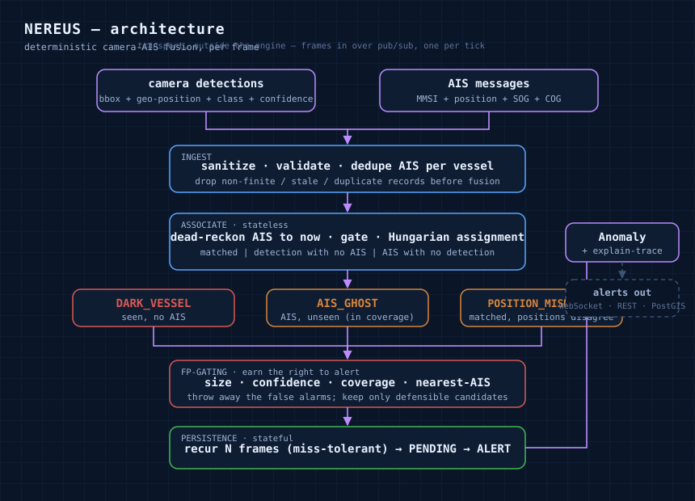

# Nereus

[](LICENSE) [](pyproject.toml) [](tests/) [](https://github.com/klaiderman/nereus)

Nereus is a deterministic engine for spotting vessels that are trying to disappear — a ship a shore camera clearly sees, but that is broadcasting no matching AIS. It takes the camera's vessel detections and the live AIS feed, correlates them, and flags the ones that don't line up. There is no model inside Nereus itself: the perception (is this a ship, how big, how sure) happens upstream in the vision pipeline, and Nereus is the deterministic layer that decides what actually warrants an alert.

The name is Nereus, the "Old Man of the Sea" in Greek myth — the one who tells no lies and yields the truth only once you pin him down and he stops shifting shape. This engine works the same way: it will not raise an alarm until a suspect has held still across enough frames to be sure of.

## Contents

- [Why](#why)
- [Architecture](#architecture)
- [How it works](#how-it-works)
- [Install](#install)
- [Using it](#using-it)
- [Testing](#testing)
- [The audit](#the-audit)
- [Roadmap](#roadmap)

## Why

A large ship is required to broadcast AIS — a transponder that continuously announces "I'm here, I'm vessel MMSI-X, this course and speed." The vessels worth worrying about are the ones that go quiet on purpose: smugglers, tankers going dark to run ship-to-ship transfers around sanctions, boats fishing where they shouldn't. AIS is easy to switch off and trivial to spoof, so you can't trust it on its own. A fixed shore camera is the ground truth — it sees the hull whatever the transponder claims. Nereus lives in the gap between the two.

Everyone else in this space works from satellite or RF AIS, which is blind to exactly the vessel that turned its AIS off. Treating the shore camera as the primary sensor and AIS as the thing to verify is the corner nobody else sits in — and it is the whole point.

The hard part isn't finding a mismatch, it's earning the right to alert on one. A raw "camera sees a vessel, no AIS" is not yet a threat: it could be a small craft that is legally exempt, a low-confidence blob the vision model isn't sure about, or a single-frame flicker off a wave. Nereus is mostly the discipline of throwing those away, so what reaches the operator is defensible.

## Architecture



Everything runs per frame. A frame is one batch of camera detections plus whatever AIS has arrived, at a timestamp. The correlation is deliberately stateless — one frame in, one clean split out. Persistence is the only stateful piece, kept separate on purpose.

## How it works

AIS arrives every few seconds and the camera runs continuously, so an AIS report is almost never stamped at frame time; each one is dead-reckoned forward along its own course and speed before distances are measured, otherwise a perfectly matched vessel looks displaced. Matching is a global assignment (`scipy.optimize.linear_sum_assignment`) rather than nearest-neighbour, so two vessels crowded near one AIS track don't produce a bogus pairing.

Three things can come out of it, and they are the three ways a broadcast can diverge from reality:

- **DARK_VESSEL** — a detection with no AIS. The transponder is silent.
- **AIS_GHOST** — an AIS track inside a camera's coverage with nothing on screen. The broadcast is fabricated.
- **POSITION_MISMATCH** — a matched pair whose positions disagree by more than the mismatch threshold. The broadcast is displaced — the spoofing signature.

A candidate has to recur for a few consecutive frames to promote from `PENDING` to `ALERT`, and a brief gap (a dropped frame, a moment of occlusion) is tolerated rather than resetting the count. Every alert carries a trace of the gates it cleared, so an operator can see not just what fired but why it earned the right to.

## Install

```bash
pip install git+https://github.com/klaiderman/nereus
```

Or from a clone, for development:

```bash
git clone https://github.com/klaiderman/nereus
cd nereus
pip install -e ".[dev]"
pytest
```

## Using it

```python
from nereus import NereusEngine
from nereus.enums import AnomalyState
from nereus.models.camera import Camera

engine = NereusEngine(cameras=[Camera("shore-1", 31.815, 34.615, range_m=3000.0)])

for detections, ais_messages, frame_ts in feed:
    for anomaly in engine.process_frame(detections, ais_messages, frame_ts):
        if anomaly.state is AnomalyState.ALERT:
            handle(anomaly)   # anomaly.type, .subject_id, .trace, ...
```

The engine is a pure library — it does not fetch anything, you feed it a frame at a time. In production the detection and AIS streams arrive over pub/sub, alerts go out over a WebSocket to the operator console with REST for history, and tracks are stored in PostGIS. It is not an MCP server or an agent tool; this is a maritime data service.

## Testing

```bash
pytest
```

The suite covers each stage in isolation plus a full harbour scenario as a regression test — a fishing skiff that must stay silent, a large dark vessel that must alert only after it persists, a ghost, and a clean matched pair. It also pins every failure mode found in the audit below (NaN coordinates, duplicate MMSI, the greedy-assignment trap, cross-camera identity, replayed frames) so a fix can't silently regress. Same input, same alerts, every time.

## The audit

The interesting half of the work was breaking it on purpose. A systematic pass turned up 19 issues — a NaN coordinate taking down a whole frame, duplicate AIS reports surfacing as phantom ghosts, global assignment manufacturing false mismatches, a `det_id` colliding with a `str(mmsi)` in the persistence keys, at-least-once replays double-counting toward an alert. Sixteen are fixed with a regression test each; the rest are on the roadmap. Most of them are the same list you'd hit at scale — the alert flood, cross-camera identity, message-bus replays, high-volume AIS edge cases — just looked at from a different angle.

## Roadmap

- **Spatial pre-filter for scale** — the cost matrix is `O(n·m)` and the assignment `O(n³)`, which is fine for a slice but won't hold frame rate in a busy port (hundreds of vessels times hundreds of detections). A grid or KD-tree so only near neighbours are compared makes the matrix sparse; PostGIS does the same job server-side.
- **Spoof detection** (`SPOOF_SUSPECT`) — it exists in the enum but isn't raised. Detecting a spoofed identity is a temporal-consistency problem on the AIS itself — impossible kinematics, MMSI collisions — a genuinely different problem from spatial association, so it gets its own layer rather than a shallow bolt-on.
- **Suppression records** — right now a candidate that gets gated out disappears. For a defensible product you want to answer "why did you *not* alert on that one," which means surfacing the suppression and its reason, not just the alerts.
- **Coverage and clock** — the camera coverage is a range circle; a real deployment needs a proper viewshed, and the cross-source clock skew between the detection feed and AIS needs normalising before either can be trusted at the millisecond level.
