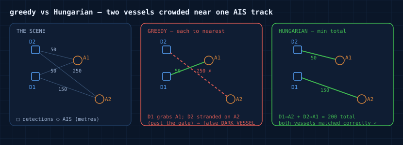
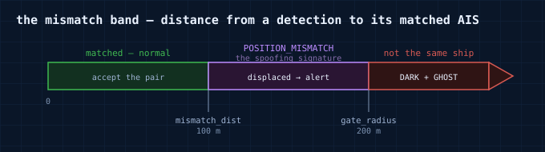

# Design notes

A few decisions that aren't obvious from the code.

## Why Hungarian, not nearest-neighbour

Matching detections to AIS tracks is an assignment problem, and greedy "each detection to its closest AIS" gets it wrong the moment two vessels crowd near one track.

Two detections `D1`, `D2` and two AIS tracks `A1`, `A2`. `D1` is 50 m from `A1` and 150 m from `A2`; `D2` is 50 m from `A1` and 250 m from `A2` (past the gate).

- **Greedy** (each detection to its nearest AIS) hands `A1` to whichever detection it processes first and pushes the other onto `A2`. If `D2` lands on `A2` at 250 m it's past the gate and goes unmatched — a false `DARK_VESSEL` — while `D1` keeps a partner it shouldn't have.
- **Hungarian** (minimise total distance) picks `D1→A2` (150) + `D2→A1` (50) = 200, lower than any greedy assignment, so both vessels get their correct partner.

Greedy commits locally and can't undo it; Hungarian sees the whole board. It's `scipy.optimize.linear_sum_assignment`, with the gate baked into the cost matrix so it never prefers a pair it would only have to discard.

## The mismatch band

The distance between a detection and its matched AIS is the whole signal:

A matched pair is only a mismatch if no *other* AIS sits within `mismatch_dist` of the detection — a nearer track means the assignment was wrong, not the position. And the threshold grows with how far the AIS had to be dead-reckoned, so a manoeuvring vessel carrying a stale report isn't flagged for a gap that projection, not spoofing, explains.

## Why deterministic

The perception — is this a ship, how big, how sure — is genuinely learned, and it happens upstream in the vision model. The decision to alert is not: it's an enforcement call, and it has to be reproducible and defensible. A rule with an explain-trace — *size 120 m ≥ exempt, no matching AIS, persisted 3/3 frames* — is something an operator can stand behind in front of a commander; a model's anomaly score of 0.87 is not. So the ML stays upstream where it belongs, and Nereus is the deterministic layer on top of it.

## Coverage-gated ghosts

An AIS track with no vessel on screen is only suspicious if a camera actually watches where it claims to be. A shore camera sees a wedge; an AIS receiver hears the whole horizon. Without a coverage check, every distant broadcast beyond the camera's reach would raise a ghost, and the operator's screen would be noise by the end of the first hour. So a ghost is raised only when the AIS's projected position falls inside a camera's coverage — the difference between "out of range, of course unseen" and "should have been seen, and wasn't."
